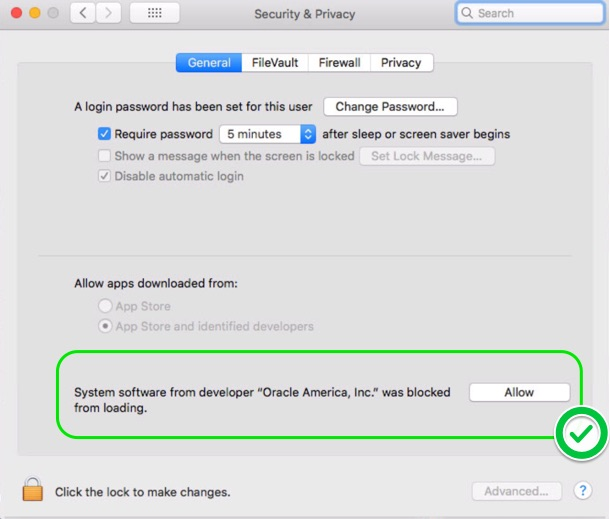

# MariaDB Kubernetes MaxScale Master Slave using StatefulSets
This directory contains a simple evaluation example showing a Master with 3 Slave cluster fronted by MaxScale. Two StatefulSets are created for MaxScale and the Master/Slave cluster.

## Installing microk8s on Linux
Microk8s is a lightweight kubernetes install that can be installed using the cross
platform snap utility, however it is best run on ubuntu distributions.
```sh
sudo snap install microk8s --beta --classic
microk8s.enable dns dashboard storage
```

After installation the kubernetes dashboard application may be accessed at:
http://localhost:8080/api/v1/namespaces/kube-system/services/https:kubernetes-dashboard:/proxy

## Installing minikube on Windows 10 Professional with Hyper-V
- Download minikube for windows from: https://github.com/kubernetes/minikube/releases and rename to minikube.exe and add to a directory in your path.
- Similarly download kubectl and add to the same directory: https://storage.googleapis.com/kubernetes-release/release/v1.11.0/bin/windows/amd64/kubectl.exe
- Create an external switch in hyper-v virtual switch manager named ExternalSwitch configured to use external networking.

Now initialize minikube:
```sh
minikube start --vm-driver hyperv --hyperv-virtual-switch "ExternalSwitch"
```

After installation the kubernetes dashboard application may be accessed by running:
```sh
minikube dashboard
```

## Installing minikube on MacOS X (High Sierra)

### Install Homebrew

Homebrew is a external package manager for OSX it is requred for the instalation of some of the components below.(Homebrew is not the only way to install those for more information refer to [Other ways to install k8s](https://kubernetes.io/docs/tasks/tools/install-kubectl/#install-with-macports-on-macos)

Open your Terminal app. Press cmd+space and type terminal.app
Type the folowing command in the terminal window.
```$ /usr/bin/ruby -e “$(curl -fsSL https://raw.githubusercontent.com/Homebrew/install/master/install)”```
This will start Homebrew instalation. 
(it will require Xcode Command Line Tools they will be installed or updated in the process.)

### Install Hypervisor

A hypervisor is required for the Kubectl to work on OSX. the popular options are  VirtualBox or VMware Fusion, or HyperKit.
This guide will do the instalations with VirtualBox

#### VirtualBox

[VirtualBox for OSX](https://download.virtualbox.org/virtualbox/5.2.18/VirtualBox-5.2.18-124319-OSX.dmg)
Download the package above and follow the instructions. OSX my require allowing this package in security & privacy section. 


[Other Install Options](https://www.virtualbox.org/wiki/Downloads)

### Install Kubernetes command-line tool(kubectl)

Instalation with brew is simple
Type the following in your teminal window. 
* ```$ brew install kubernetes-cli```

### Install Minikube

Minikube can be installed using the following comand
```curl -Lo minikube https://storage.googleapis.com/minikube/releases/v0.28.2/minikube-curl -Lo minikube https://storage.googleapis.com/minikube/releases/v0.28.2/minikube-darwin-amd64 && chmod +x minikube && sudo mv minikube /usr/local/bin/```

Additional versions can be found [here](https://github.com/kubernetes/minikube/releases)

### Start Minikube

The minikube can be started using the following comand
` $ minikube start `
To stop the cluster use:
` $ minikube stop `

## To Run
You must first have a working kubernetes installation. For local standalone installations you may use minikube for Windows / MacOS X / Linux or microk8s (Linux).

For Linux and Mac systems type the following in a shell :
```sh
./create-masterslave-cluster.sh -a myapp -e dev
```

For windows type the following in powershell:
```sh
./create-masterslave-cluster.ps1 -a myapp -e dev
```

To access the MaxScale node locally, create a port forward (substitute the appropriate pod name in the port forward command):
```sh
kubectl get pod
kubectl port-forward maxscale-d76cbd47c-sjb4t 4006:4006 4008:4008 9195:9195
```
After this:
```
curl http://localhost:9195/metrics
mysql -umaxuser -pmaxpwd -P4006 -h 127.0.0.1
```

